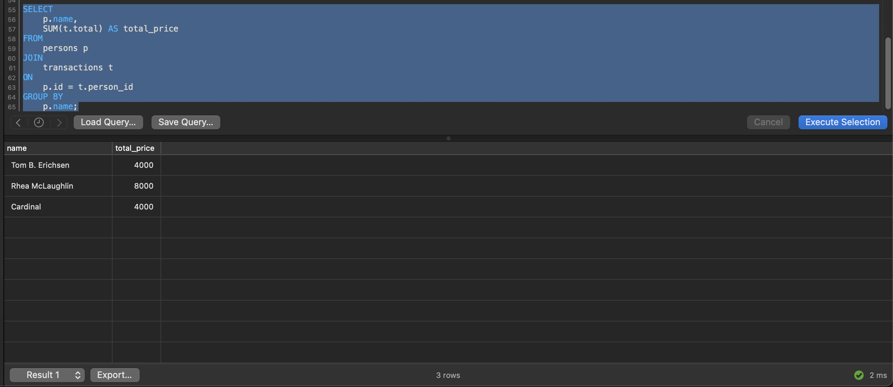
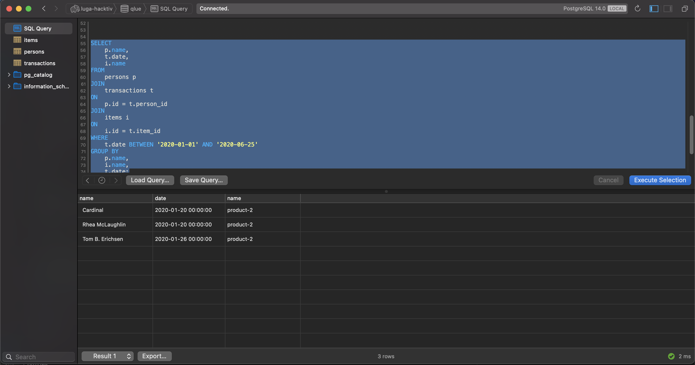
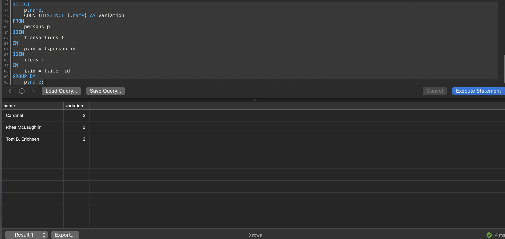
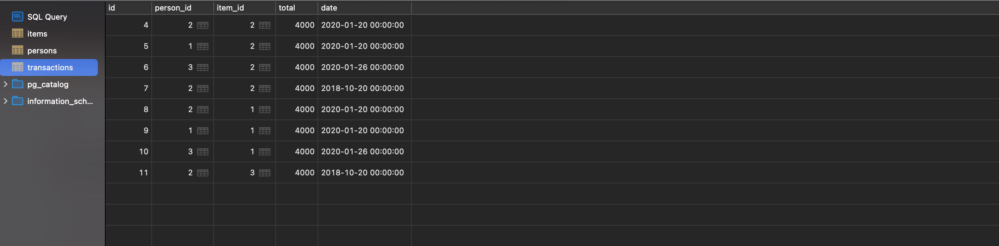

# SQL Query Ans :

## Set Up

alter structure table so id will become serial.

```sql
-- create sequence
CREATE SEQUENCE persons_id_seq OWNED BY persons.id;
CREATE SEQUENCE items_id_seq OWNED BY items.id;
CREATE SEQUENCE transactions_id_seq OWNED BY transactions.id;
```

```sql
-- use sequence for the person column id so it will become serial
ALTER TABLE persons ALTER COLUMN id SET DEFAULT nextval('persons_id_seq');
ALTER TABLE items ALTER COLUMN id SET DEFAULT nextval('items_id_seq');
ALTER TABLE transactions ALTER COLUMN id SET DEFAULT nextval('transactions_id_seq');
```

## Seeding

add some dummy data

```sql
-- insert dummy data on persons table, because the id is serial, we dont need to add id manualy
INSERT INTO 
	persons (name)
VALUES 
	('Cardinal'),
	('Rhea McLaughlin'), 
	('Tom B. Erichsen');

-- insert dummy data on item table, because the id is serial, we dont need to add id manualy
INSERT INTO 
	items (name, price)
VALUES 
	('product-1', '1000'),
	('product-2', '2000'),
	('product-3', '3000');
	
-- insert dummy data on transactions table, because the id is serial, we dont need to add id manualy
INSERT INTO 
	transactions (person_id, item_id, total, date)
VALUES 
	(2, 2, 4000, '2020-01-20'),
	(1, 2, 4000, '2020-01-20'),
	(3, 2, 4000, '2020-01-26'),
	(2, 2, 4000, '2018-10-20');
```

1) Provide a query select statement to return the following result structure:
    - name; total_price
    - Where name is the name of “persons” and total_price is the total of price from the items transaction completed by the person.

```sql
SELECT 
	p.name, 
	SUM(t.total) AS total_price
FROM 
	persons p
JOIN 
	transactions t
ON 
	p.id = t.person_id
GROUP BY 
	p.name;
```




2) Provide a query select statement to return the transaction complete with name of person, and name of item between January 1st, 2020 and June 25th, 2020.

```sql
SELECT 
	p.name, 
	t.date,
	i.name
FROM 
	persons p
JOIN 
	transactions t
ON 
	p.id = t.person_id
JOIN 
	items i
ON 
	i.id = t.item_id
WHERE 
	t.date BETWEEN '2020-01-01' AND '2020-06-25'
GROUP BY 
	p.name,
	i.name,
	t.date;
```


3) Provide a query select statement to return a list of the name of the person who made transactions based on the total variety of items purchased, sorted from the most to the fewest.


```sql
SELECT 
	p.name, 
	COUNT(DISTINCT i.name) AS variation
FROM 
	persons p
JOIN 
	transactions t
ON 
	p.id = t.person_id
JOIN 
	items i
ON 
	i.id = t.item_id
GROUP BY 
	p.name;
```


